# Arquitetura e análise de falhas da ingestão de documentos

## Escopo

Este documento descreve a implementação atual, desde a seleção do arquivo no navegador até a gravação de todos os embeddings e a mudança do `Resource` para `PROCESSED`. A análise é estática e se baseia no código e no template SAM presentes neste repositório.

## Diagrama da arquitetura atual

```mermaid
flowchart LR
  classDef state fill:#e8f1ff,stroke:#3b82f6,color:#111827
  classDef compute fill:#ecfdf5,stroke:#10b981,color:#111827
  classDef queue fill:#fff7ed,stroke:#f59e0b,color:#111827
  classDef external fill:#f5f3ff,stroke:#8b5cf6,color:#111827
  classDef failure fill:#fef2f2,stroke:#dc2626,color:#7f1d1d,stroke-dasharray:5 3

  subgraph Client[Cliente]
    UI[Frontend React<br/>seleciona arquivo e metadados]
    Upload[XHR multipart direto ao S3]
    Poll[GET /api/resource<br/>consulta status]
  end

  subgraph API[API Express]
    Presign[POST /api/upload<br/>gera presigned POST]
    Register[POST /api/resource<br/>cria Resource e inicia Textract]
  end

  subgraph Data[Persistência]
    AppDB[(PostgreSQL da aplicação<br/>Resource: UPLOADED → PROCESSING → PROCESSED)]
    EmbDB[(PostgreSQL de embeddings<br/>INSERT content, vector, pages, document)]
    Track[(DynamoDB EmbeddingBatches<br/>document → batches pending/processing/completed)]
  end

  subgraph AWS[AWS e processamento assíncrono]
    UploadBucket[(S3 UploadedResourcesBucket<br/>versionamento habilitado)]
    Textract[Amazon Textract<br/>StartDocumentAnalysis LAYOUT]
    OutputBucket[(S3 TextractOutputBucket<br/>resultados do Textract)]
    Topic[SNS TextractSNSTopic]
    Q1[[SQS ProcessedDocumentsQueue<br/>visibility 120 s · retenção 4 d · maxReceive 5]]
    L1[Lambda ChunkingFunction<br/>timeout 30 s · batch size 1]
    Q2[[SQS DocumentChunksQueue<br/>visibility 120 s · retenção 4 d · maxReceive 5]]
    L2[Lambda EmbeddingFunction<br/>timeout 60 s · batch size 1]
    DLQ1[[ProcessedDocumentsDLQ<br/>retenção 14 d]]
    DLQ2[[DocumentChunksDLQ<br/>retenção 14 d]]
    Secrets[Secrets Manager<br/>OpenAI e URLs dos bancos]
  end

  OpenAI[OpenAI Embeddings API<br/>text-embedding-3-small · 1024 dimensões]

  UI -->|1. pede URL com contentType| Presign
  Presign -->|2. URL + campos, expira em 600 s| UI
  UI -->|3. envia arquivo| Upload
  Upload --> UploadBucket
  UI -->|4. filename, fileType, objectKey, tags| Register
  Register -->|5. INSERT UPLOADED| AppDB
  Register -->|6. StartDocumentAnalysis<br/>token = hash do objectKey| Textract
  Register -->|7. UPDATE PROCESSING + jobId| AppDB
  Textract -->|8. grava saída| OutputBucket
  Textract -->|9. evento terminal| Topic
  Topic --> Q1
  Q1 --> L1
  L1 -->|10. GetItem: já enfileirado?| Track
  L1 -->|11. GetDocumentAnalysis paginado| Textract
  L1 -->|12. lineariza layout, chunks de 1000 chars<br/>overlap 400, lotes até 8192 tokens| L1
  L1 -->|13. SendMessageBatch, ids estáveis| Q2
  L1 -->|14. PutItem após publicar todos os lotes| Track
  Q1 -. após 5 recebimentos .-> DLQ1
  Q2 --> L2
  Secrets --> L2
  L2 -->|15. claim condicional pending → processing| Track
  L2 -->|16. um request por lote| OpenAI
  OpenAI -->|vetores| L2
  L2 -->|17. INSERT sem chave idempotente visível| EmbDB
  L2 -->|18. processing → completed<br/>e verifica todos os lotes| Track
  L2 -->|19. último lote: UPDATE PROCESSED| AppDB
  Q2 -. após 5 recebimentos .-> DLQ2
  Poll --> AppDB

  F1{{F1: objeto pode ficar órfão}}:::failure
  F2{{F2: Resource/job pode ficar inconsistente}}:::failure
  F3{{F3: publicação e tracking não são atômicos}}:::failure
  F4{{F4: claim pode ficar preso em processing}}:::failure
  F5{{F5: INSERT e conclusão não são atômicos}}:::failure
  F6{{F6: DLQ não atualiza Resource nem é drenada}}:::failure

  UploadBucket -.-> F1
  Register -.-> F2
  Q2 -.-> F3
  Track -.-> F4
  EmbDB -.-> F5
  DLQ1 -.-> F6
  DLQ2 -.-> F6

  class AppDB,EmbDB,Track,UploadBucket,OutputBucket state
  class Presign,Register,L1,L2 compute
  class Q1,Q2,DLQ1,DLQ2,Topic queue
  class Textract,Secrets,OpenAI external
```

## Garantias que já existem

- As duas filas têm retry implícito, `maxReceiveCount: 5`, DLQ e retenção de quatro dias; as DLQs retêm mensagens por 14 dias.
- As Lambdas retornam `ReportBatchItemFailures`; como o `BatchSize` atual é 1, uma falha faz somente aquela mensagem reaparecer.
- Os lotes de chunks têm IDs determinísticos derivados de `jobId`, índice e conteúdo.
- O envio em lote ao SQS tenta novamente, até três vezes, apenas as entradas não aceitas e interrompe em `SenderFault`.
- O claim no DynamoDB é condicional (`pending → processing`), evitando que duas invocações processem simultaneamente o mesmo lote em condições normais.
- Uma mensagem repetida de lote já concluído não chama novamente a OpenAI. Se todos os lotes estão concluídos, ela tenta novamente apenas a atualização final do `Resource`.
- S3 e os recursos de fila/tabela têm políticas de retenção; os buckets têm versionamento e criptografia habilitados.

Essas garantias entregam processamento *at-least-once* em partes do fluxo, mas não entregam conclusão garantida nem persistência *exactly-once*.

## Pontos de falha

| Prioridade | Ponto/janela de falha | Comportamento atual | Consequência |
|---|---|---|---|
| Crítica | Upload no S3 termina, mas o navegador fecha, perde rede ou falha antes de `POST /api/resource` | Nenhum evento S3 inicia ou reconcilia a ingestão | Objeto órfão; não existe `Resource`, job ou retry server-side |
| Crítica | API cria `Resource` e falha antes/durante `StartDocumentAnalysis` | A exceção devolve 500, mas o registro `UPLOADED` fica persistido | Registro preso; retry do cliente cria outro `Resource` porque `objectKey` não é único |
| Crítica | Textract inicia, mas a API cai antes de salvar `jobId`/`PROCESSING` | O job pode continuar e publicar SNS, enquanto o banco ainda mostra `UPLOADED` | Estado contraditório; podem existir múltiplos registros para o mesmo objeto |
| Alta | Atualização para `PROCESSING` funciona, mas a resposta HTTP se perde | Cliente considera falha e pode registrar novamente o mesmo objeto | Duplicidade de `Resource`; no final, o `UPDATE ... WHERE objectKey` altera todos eles |
| Alta | Textract devolve `FAILED` ou outro status não `SUCCEEDED` | A Lambda lança erro cinco vezes e a mensagem vai à DLQ | `Resource` permanece `PROCESSING`; o enum `FAILED` nunca é usado |
| Alta | SNS→SQS falha por configuração/permissão, ou a notificação nunca chega | Não há timeout de negócio nem reconciliação por `jobId` | Documento fica `PROCESSING` indefinidamente |
| Alta | `GetDocumentAnalysis`, paginação, linearização ou chunking excede 30 s/memória | SQS tenta novamente e depois envia à DLQ | Reprocessamento integral; `Resource` não recebe causa nem estado terminal |
| Crítica | Chunking publica alguns/todos os lotes e falha antes do `PutItem` no DynamoDB | Na repetição, publica tudo novamente; consumidores podem executar antes de existir o tracking | Corrida entre Q2 e DynamoDB, retries desnecessários e possível DLQ prematura; IDs estáveis mitigam duplicatas somente depois do tracking existir |
| Alta | Documento não produz texto/chunks | É gravado tracking com zero lotes, mas nenhuma mensagem dispara a etapa final | Documento permanece `PROCESSING` para sempre |
| Crítica | Embedding Lambda é encerrada por timeout/OOM/deploy depois do claim | O `catch` não roda; o lote continua `processing` sem lease/TTL | Toda repetição recusa o claim como “já em processamento”; após cinco tentativas a mensagem vai à DLQ |
| Alta | OpenAI retorna 429, 5xx, timeout, resposta inválida, chave inválida ou limite de tokens | Em erro capturável, o claim volta para `pending` e o SQS tenta novamente | Transientes podem se recuperar; permanentes consomem cinco tentativas e vão à DLQ, sem marcar `Resource` como `FAILED` |
| Crítica | Embeddings são inseridos, mas `completeBatch` falha | O `catch` libera o lote para `pending` | A próxima tentativa chama OpenAI e faz novo `INSERT`; não há `batchId/chunkId` persistido nem `UNIQUE`/upsert visível para impedir duplicatas |
| Crítica | Lambda morre depois do `INSERT`, antes de `completeBatch` | O lote fica `processing` e os dados já foram gravados | Combina duplicidade potencial com lote irrecuperavelmente preso |
| Média | Último lote completa no DynamoDB, mas o update do banco da aplicação falha | A repetição detecta “document-completed” e tenta o update novamente | Esta janela é recuperável enquanto a mensagem não esgotar as cinco tentativas e os bancos voltarem |
| Alta | DynamoDB recebe muitos lotes em um único item ou mensagem SQS fica grande | Não há pré-validação dos limites físicos; tracking usa um mapa único por documento | Documento grande/patológico pode falhar permanentemente e ir à DLQ |
| Alta | Palavra/texto individual ultrapassa o tamanho de chunk/lote/modelo | O splitter não divide uma palavra maior que o limite e o batch aceita um chunk maior que 8192 tokens | Rejeição permanente da OpenAI ou mensagem excessiva |
| Alta | Pico de uploads aumenta concorrência | Não há `MaximumConcurrency`, reserved concurrency, rate limiter ou backpressure por dependência | Throttling da OpenAI, exaustão de conexões dos Postgres e tempestade de retries/DLQ |
| Alta | Secrets Manager ou URLs/credenciais dos bancos falham | Inicialização do processor falha; SQS repete | Após cinco recebimentos, DLQ; nenhuma alteração de estado no `Resource` |
| Alta | Mensagem chega à DLQ | Não existem alarmes, consumidor, redrive automático/manual documentado ou atualização de status | DLQ apenas armazena a falha por 14 dias; depois a evidência expira |
| Média | Logs expiram em 14 dias e não há métricas de negócio | X-Ray está ativo, mas não há alarmes para idade da fila, DLQ, stuck jobs ou taxa de conclusão | Falhas silenciosas e diagnóstico tardio |
| Média | API aceita `objectKey` apenas pelo prefixo do usuário | Não faz `HeadObject`, validação do tipo real, checksum, versão ou vínculo de uso único | Job pode apontar para objeto ausente, sobrescrito ou já registrado |
| Média | API responde usando o objeto anterior ao `update` | A resposta da criação ainda representa `UPLOADED`, embora o banco já esteja `PROCESSING` | UI/cliente recebe estado defasado imediatamente após criar o recurso |
| Alta | Lambda de expiração executa `HeadObject` antes de um upload concorrente terminar e marca o registro como `EXPIRED` antes da chegada do evento S3 | `updatedAt`, o cutoff e o `UPDATE` condicional por `PENDING_UPLOAD` protegem retomadas recentes e eventos que vencem a corrida; permanece uma janela residual se o objeto surgir depois do `HeadObject` e antes da expiração | Objeto válido pode ficar no S3 com registro `EXPIRED` e não seguir para processamento; revisar com estado intermediário `EXPIRING`, segunda verificação após período de graça ou reconciliação segura de `EXPIRED → UPLOADED` |

## Cenários pedidos explicitamente

### OpenAI retorna erro

Se a chamada rejeitar de forma capturável, `releaseBatch` tenta voltar o lote de `processing` para `pending`; a mensagem é devolvida como falha e reaparece na SQS. Isso funciona para uma indisponibilidade curta. Se o erro persistir, a quinta recepção leva a mensagem à `DocumentChunksDLQ`, mas o `Resource` continua `PROCESSING`. Se a Lambda for encerrada antes de executar o `catch`, nem o release acontece.

### Lambda encerra antes da finalização

- **Antes do claim:** a mensagem reaparece e pode ser processada normalmente.
- **Depois do claim e antes do `INSERT`:** o lote fica preso em `processing`, pois não existe lease expirável.
- **Depois do `INSERT` e antes de marcar o lote completo:** os embeddings já existem, mas o lote fica preso; uma recuperação manual que o devolva para `pending` pode duplicar linhas.
- **Depois de marcar o lote completo e antes de atualizar `Resource`:** esta é a melhor janela: uma repetição reconhece que o documento já terminou e tenta novamente o update final.

### SQS entrega mensagem duplicada

O ID estável mais o claim condicional evita trabalho duplicado se o tracking já existe e o lote está `completed`. Não protege a janela anterior à criação do tracking, nem a janela entre o `INSERT` dos embeddings e a conclusão no DynamoDB.

## Causa estrutural

O estado lógico de uma ingestão está distribuído entre S3, PostgreSQL da aplicação, Textract, SNS, duas filas, DynamoDB, OpenAI e PostgreSQL de embeddings. Há quatro commits relevantes sem uma unidade transacional ou reconciliador:

1. objeto no S3 versus criação do `Resource`;
2. criação do `Resource` versus início/registro do job Textract;
3. publicação de todos os lotes versus criação do tracking;
4. inserção dos embeddings versus conclusão do lote.

Por isso, retry sozinho não fecha todas as janelas: em algumas ele duplica dados; em outras encontra um lock permanente; em outras não existe mensagem para repetir.

## Ordem recomendada de correção

1. Tornar a persistência de embeddings idempotente: gerar `chunkId` determinístico, persistir `batchId/chunkId`, criar `UNIQUE(document, chunkId)` e usar upsert/transação no banco de embeddings.
2. Transformar o claim em lease (`processingUntil`, `attempt`, `owner`) que possa ser retomado após timeout; configurar o trabalho para parar antes do tempo restante da Lambda acabar.
3. Eliminar a corrida Q2/DynamoDB com um estado criado antes da publicação e uma fase de outbox/dispatcher, ou usar Step Functions para orquestrar e registrar cada transição.
4. Tirar do navegador a responsabilidade de completar o handshake: criar a intenção antes do upload e finalizar via evento S3, ou reconciliar uploads sem `Resource`; tornar `objectKey`/`uploadId` único e idempotente.
5. Persistir estados e causas explícitas (`UPLOADED`, `TEXTRACT_STARTING`, `EXTRACTING`, `CHUNKING`, `EMBEDDING`, `PROCESSED`, `FAILED_RETRYABLE`, `FAILED_FINAL`) com histórico de tentativas.
6. Tratar `Textract FAILED`, zero chunks e DLQ como estados terminais visíveis. Criar consumidor/redrive controlado e um reconciliador periódico para jobs/lotes parados.
7. Adicionar limites e backpressure: concorrência máxima por Lambda, retry com jitter para OpenAI, validação do tamanho SQS/token, timeout por chamada e limites de conexão.
8. Criar alarmes para mensagens nas DLQs, idade da mensagem mais antiga, `Resource` preso, lease expirada e divergência entre batches completos e status do documento.

## Arquivos que sustentam o desenho

- `frontend/src/controllers/upload-materials-controller.tsx` e `frontend/lib/upload-service.ts`: sequência presign → upload → registro.
- `api/src/routes/upload.ts`: presigned POST e chave por usuário.
- `api/src/routes/resource.ts`: criação do `Resource`, início do Textract e transição para `PROCESSING`.
- `infrastructure/template.yaml`: SNS, filas/DLQs, Lambdas, timeouts, DynamoDB, S3, IAM e Secrets Manager.
- `document-ingestion/src/ingestion/document-processor.ts`: validação do Textract, chunking, publicação e tracking.
- `document-ingestion/src/adapters/sqs-batch-publisher.ts`: envio parcial/retry e IDs estáveis.
- `document-ingestion/src/embeddings/embedding-processor.ts`: claim, OpenAI, persistência, conclusão e compensação.
- `document-ingestion/src/adapters/aws-embedding-adapters.ts`: operações concretas em DynamoDB, OpenAI e nos dois Postgres.
